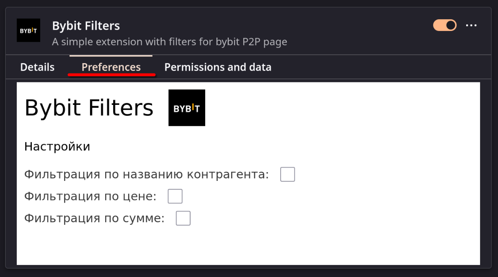
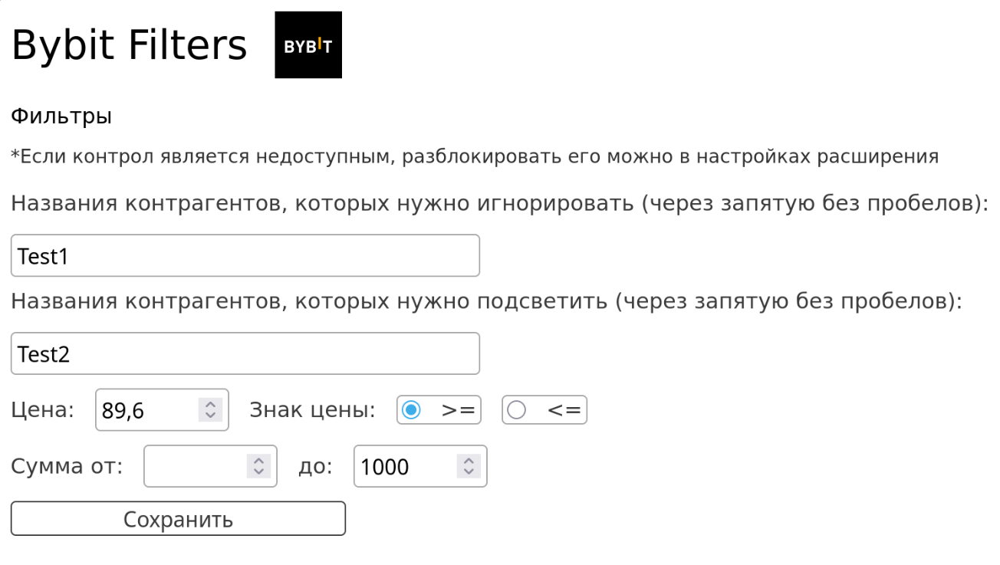
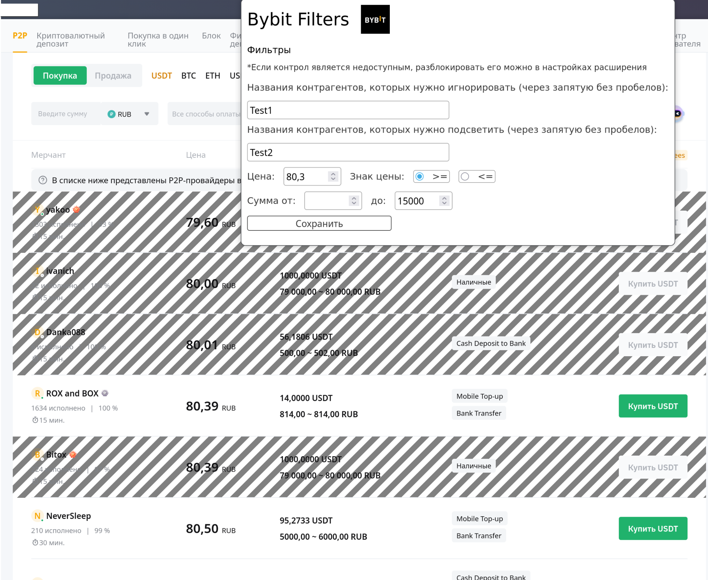

# Bybit Filters

[Firefox extension](https://addons.mozilla.org/en-US/firefox/extensions/) for filtering P2P offers on [Bybit](https://www.bybit.com/ru-RU/fiat/trade/otc/buy/USDT/RUB) written with [Angular](https://angular.dev/).

### How it looks like

*Whole UI is written in Russian language.*

You can choose needed filters on Preferences page:



In popup you can set values for chosen filters:



> You have to click button to save values. Otherwise changes will not be setup.

Offers that **are** suitable for filters will not be affected.  
Offers that **are not** suitable for filters will be painted over. 



This selection is running only on [USDT/RUB pair page](https://www.bybit.com/ru-RU/p2p/buy/USDT/RUB) (see [manifest.json](https://github.com/DKozachenko/bybit-filters/blob/05ca4391d31cae1a40e5eaf9dbbec6a3d134d7b5/assets/manifest.json#L31)).

### Run as SPA in browser

```bash
npm ci
npm run start:web
```

### Run as extension

```bash
npm ci
npm run assembly:ext
```

[Install](https://developer.mozilla.org/en-US/docs/Mozilla/Add-ons/WebExtensions/Your_first_WebExtension#installing) as custom extension using path `./dist/bybit-filters/browser`.

### References

- https://habr.com/ru/articles/851234/
- https://habr.com/ru/articles/858078/

### CHANGELOG

#### [1.0.0] - 09.02.2025

### Added

- Main functional of filtering
- Options component for extension options
- Popup component for showing popup on extension icon

#### [1.1.0] - 09.02.2025

### Changed

- Default values for form in popup component are `null`
- `setInterval` in content script (`filter-offers.js`) each 3s to `MutationObserver` on table tr elements

#### [1.2.0] - 11.02.2025

### Added

- Filter inaccessible offers by default
- CSS background strips for unsuitable elements
- Disabling button for unsuitable elements
- Remove emodjis from counterparty name for better checking 

#### [1.3.0] - 11.02.2025

### Added

- Highlight for favorite counterparties

#### [1.4.0] - 18.08.2025

### Added

- Splited configurations for running as SPA and extension
- Generated content script with TS

### Changed

- Changed `matches` URL in `content_scripts`
- Fixed version of `@types/firefox-webext-browser`
- Replace `bottomLimit` and `topLimit` to `amountMin` and `amountMax`
- Replace all string values into const `enums`

### Removed

- `notInFilterElemAction` option

#### [1.5.0] - 04.09.2025

### Added

- MIT License

#### [1.5.1] - 22.10.2025

### Added

- Section 'How it looks like' to `README.md`

#### [1.5.2] - 11.12.2025

### Changed

- Handle of `tr` in offers `table`


